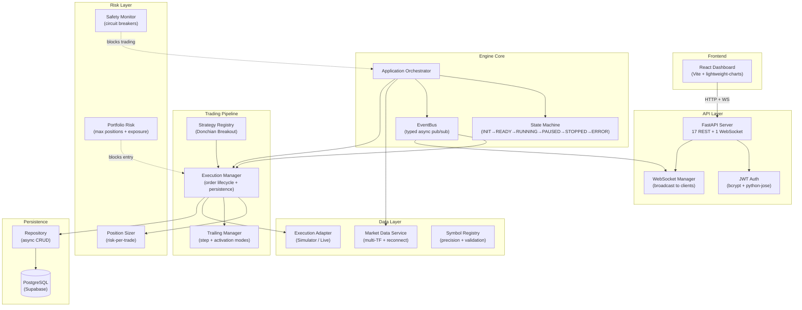

# Dashrock v2 — Technical Specification

> **Version**: 2.0.0 | **Status**: Production-Ready (Paper Mode) | **Language**: Python 3.13 + React 19

---

## 1. System Overview

Dashrock v2 is an **async-first**, **crash-resilient** Binance USDT-M Futures trading engine with a pluggable strategy system, persistent state management, and a real-time React dashboard.

### Core Capabilities
- **Pluggable Strategies** — Register any strategy via ABC interface; ships with Donchian Breakout
- **Crash Recovery** — Full execution state persisted to PostgreSQL on every change
- **Risk Management** — Position sizing by SL distance, portfolio exposure caps, tick-level circuit breakers
- **Real-Time Dashboard** — React + TradingView charts, WebSocket live data, JWT auth
- **Notifications** — Telegram + Discord alerts for trades, errors, and safety events

### Technology Stack

| Layer | Technology |
|-------|-----------|
| Runtime | Python 3.13, `asyncio` |
| Web Framework | FastAPI + Uvicorn |
| Database | PostgreSQL (Supabase) via `asyncpg` + SQLAlchemy 2.x |
| Auth | JWT (`python-jose`) + bcrypt (`passlib`) |
| HTTP Client | `httpx` (async, for Telegram/Discord) |
| Dashboard | React 19 + Vite + `lightweight-charts` |
| Config | Pydantic v2 models + YAML |

---

## 2. Architecture



---

## 3. Module Reference

### 3.1 Core (`src/dashrock/core/`)

#### `types.py` — Domain Model (216 lines)

| Type | Kind | Purpose |
|------|------|---------|
| `EngineMode` | Enum | `PAPER`, `TESTNET`, `LIVE` |
| `OrderSide` | Enum | `BUY`, `SELL` |
| `OrderType` | Enum | `MARKET`, `STOP_MARKET`, `TAKE_PROFIT_MARKET`, `LIMIT` |
| `OrderStatus` | Enum | `NEW`, `FILLED`, `CANCELED`, `REJECTED`, `PARTIALLY_FILLED` |
| `PositionState` | Enum | `FLAT`, `LONG`, `SHORT` |
| `ExitReason` | Enum | `sl`, `tp`, `trailing_sl`, `manual`, `safety`, `reversal`, `time_filter` |
| `Candle` | Frozen DC | OHLCV bar with `is_closed` flag |
| `BookTop` | Frozen DC | Best bid/ask with timestamp |
| `OrderIntent` | Frozen DC | Strategy's desired order (no ID yet) |
| `LiveOrder` | Dataclass | Order known to exchange (has ID + status) |
| `Position` | Dataclass | Open position (symbol, side, qty, entry, opened_at) |
| `Fill` | Frozen DC | Order fill notification |
| `DesiredOrders` | Dataclass | Strategy output: buy_stop + sell_stop + reference_price |
| `TradeRecord` | Dataclass | Completed trade with PnL, fees, funding |
| `SymbolExecutionState` | Dataclass | Per-symbol state (17 fields, persisted to DB) |

#### `state_machine.py` — Engine FSM (112 lines)

```
States: INITIALIZING → READY → RUNNING ⇄ PAUSED → STOPPED
                                  ↘ ERROR ↗
```

| Property | Returns |
|----------|---------|
| `status` | Current `EngineStatus` enum |
| `is_running` | `True` only in `RUNNING` state |
| `is_trading_allowed` | Same as `is_running` |

Methods: `mark_ready()`, `start()`, `pause()`, `resume()`, `stop()`, `error()`
All transitions are guarded — invalid transitions return `False` and log a warning.

#### `events.py` — EventBus (144 lines)

**Bus**: Typed async pub/sub. Handlers are awaited sequentially (backpressure, not fire-and-forget).

| Event | Fields | Emitted By |
|-------|--------|------------|
| `CandleClosed` | `candle: Candle` | MarketDataService |
| `CandleUpdated` | `candle: Candle` | MarketDataService |
| `TickUpdate` | `book: BookTop` | MarketDataService |
| `SpreadUpdate` | `symbol, spread` | SpreadGuard |
| `OrderPlaced` | `order: LiveOrder` | ExecutionManager |
| `OrderCancelled` | `order_id, symbol` | ExecutionManager |
| `FillEvent` | `fill: Fill` | ExecutionManager |
| `PositionOpened` | `symbol, side, entry_price, quantity, timestamp_ms` | ExecutionManager |
| `PositionClosed` | `symbol, side, entry/exit_price, pnl, exit_reason` | ExecutionManager |
| `EquityUpdate` | `equity_usd, timestamp_ms` | Application |
| `LogEvent` | `level, message, timestamp_ms` | Logger |
| `ScannerUpdate` | `rankings, timestamp_ms` | Scanner |
| `SafetyTriggered` | `reason, timestamp_ms` | SafetyMonitor |
| `StateChanged` | `old_state, new_state, reason` | StateMachine |
| `FundingRateUpdate` | `symbol, rate, next_funding_time_ms` | FundingTracker |

---

### 3.2 Strategy (`src/dashrock/strategy/`)

#### `base.py` — Strategy ABC

```python
class Strategy(ABC):
    def name(self) -> str: ...
    def compute(self, symbol, candles: dict[str, list[Candle]], position, current_price) -> DesiredOrders: ...
    def on_fill(self, symbol, fill) -> None: ...       # optional
    def clear_state(self, symbol) -> None: ...          # optional
    def required_timeframes(self) -> list[str]: ...     # optional
```

#### `donchian_breakout.py` — Default Strategy

**Logic**: Places Buy Stop above Highest High + offset, Sell Stop below Lowest Low − offset.

| Parameter | Type | Default | Description |
|-----------|------|---------|-------------|
| `lookback_candles` | int | 10 | Window for HH/LL calculation |
| `offset_pips` | float | 0.05 | Offset beyond HH/LL |
| `use_pct_pips` | bool | true | Interpret pips as percentage |
| `pending_refresh_mode` | str | dynamic | `dynamic` / `fixed` / `hybrid_tighter` |
| `cooldown_candles` | int | 3 | Candles to wait after position close |
| `min_channel_width_pct` | float | 0.05 | Minimum channel width as % of mid-price |

**Regime Detection** (optional):
- `method`: `adx` / `bollinger_squeeze` / `both`
- ADX < `adx_trending_threshold` (default 25) → skip entry (ranging market)

**Guards**: Stale breakout guard (skip if price already past stop level), min channel width.

#### `indicators.py` — Technical Indicator Library

| Function | Formula | Returns |
|----------|---------|---------|
| `highest_high(candles, window)` | `max(c.high)` over window | float |
| `lowest_low(candles, window)` | `min(c.low)` over window | float |
| `atr(candles, period)` | Wilder's smoothed True Range | float |
| `natr(candles, period)` | `ATR / close × 100` | float (%) |
| `adx(candles, period)` | Average Directional Index | float (0–100) |
| `bollinger_bandwidth(candles, period, std)` | `(upper − lower) / middle × 100` | float (%) |

---

### 3.3 Execution (`src/dashrock/execution/`)

#### `manager.py` — ExecutionManager (519 lines)

**Responsibilities**: Order lifecycle, fill routing, state persistence, SL/TP placement, cooldown.

**Core Methods**:

| Method | Description |
|--------|-------------|
| `apply_desired(desired, equity, blackout)` | Reconcile current vs desired orders. Idempotent. |
| `on_fill(fill)` | Route fill → entry handler or exit handler |
| `on_tick(symbol, price)` | Trailing stop update on every tick |
| `load_persisted_states()` | Restore from DB on startup (crash recovery) |
| `clear_state(symbol)` | Reset state + remove from DB |
| `get_symbol_status(symbol)` | Dict with SL/TP/trailing info for API |

**Fill Flow**:
```
Fill arrives → is it entry or exit?
├── Entry Fill:
│   ├── Set position_state to LONG/SHORT
│   ├── Place SL order (STOP_MARKET, reduce_only)
│   ├── Place TP order (TAKE_PROFIT_MARKET, reduce_only)
│   ├── Handle opposite order (cancel/keep_reverse/keep_close_only)
│   ├── Initialize trailing
│   └── Persist state + emit PositionOpened
└── Exit Fill:
    ├── Calculate PnL: (exit − entry) × qty − fees − funding
    ├── Insert TradeRecord to DB
    ├── Cancel remaining SL or TP
    ├── Reset state to FLAT
    ├── Start cooldown
    └── Persist state + emit PositionClosed
```

#### `trailing.py` — TrailingManager (153 lines)

**Two Modes**:

| Mode | Logic |
|------|-------|
| `step` | Move SL by `step_pips` for every `step_pips` of favorable price movement |
| `activation_trail` | Activate after `activation_pips` profit, then trail at `stop_pips` distance |

Both modes use the `trailing_watermark` field in `SymbolExecutionState` to track the best price since entry.

---

### 3.4 Risk (`src/dashrock/risk/`)

#### `position_sizer.py`

```
risk_amount = equity × (risk_pct / 100)
sl_distance = |entry_price − sl_price|
quantity = risk_amount / sl_distance
```

#### `portfolio.py` — PortfolioRiskManager

| Check | Config Key | Default |
|-------|-----------|---------|
| Max open positions | `max_open_positions` | 3 |
| Max total exposure | `max_total_exposure_pct` | 300% |
| Max per-symbol exposure | `max_per_symbol_exposure_pct` | 100% |

Returns `PortfolioCheck(allowed: bool, reason: str)`.

#### `safety.py` — SafetyMonitor

| Circuit Breaker | Config Key | Default | Trigger |
|----------------|-----------|---------|---------|
| Daily loss limit | `max_daily_loss_pct` | 5% | `daily_pnl / starting_equity > threshold` |
| Drawdown limit | `max_drawdown_pct` | 15% | `(high_water − current) / high_water > threshold` |
| Consecutive losses | `max_consecutive_losses` | 5 | Count from most recent trade backwards |

Checked on every candle close. Optional tick-level checks every N ticks (`tick_check_interval: 100`).

---

### 3.5 Adapters (`src/dashrock/adapters/`)

#### `base.py` — ExecutionAdapter ABC

```python
class ExecutionAdapter(ABC):
    async def start(self) -> None: ...
    async def stop(self) -> None: ...
    def set_fill_handler(self, handler) -> None: ...
    async def place_order(self, intent: OrderIntent) -> LiveOrder: ...
    async def cancel_order(self, symbol, order_id) -> None: ...
    async def cancel_all_orders(self, symbol) -> None: ...
    async def get_open_orders(self, symbol) -> list[LiveOrder]: ...
    async def get_position(self, symbol) -> Position: ...
    async def get_equity_usd(self) -> float: ...
    async def batch_cancel(self, symbol, order_ids) -> int: ...        # optional
    async def get_funding_rate(self, symbol) -> float | None: ...      # optional
```

#### `simulator.py` — SimulatorAdapter (Paper Trading)

In-memory matching engine with:
- **Stop order triggers**: Compares bid/ask against stop_price on every `on_book()` call
- **Fee simulation**: Configurable taker fee (default 0.04%)
- **Slippage noise**: Random offset (default 0.01%)
- **Funding simulation**: Applies funding rate to open positions every 8h
- **Latency simulation**: Configurable delay before fill callback
- **Atomic state**: Thread-safe position/equity tracking

---

### 3.6 Persistence (`src/dashrock/persistence/`)

#### Database Schema (8 Tables)

| Table | PK | Key Columns | Purpose |
|-------|----|-----------|---------| 
| `trades` | `id` (auto) | symbol, side, entry/exit_price, realized_pnl, fees, funding_cost, exit_reason | Completed trades |
| `orders` | `id` (auto) | order_id (unique), symbol, side, type, stop_price, status, tag | Order audit log |
| `equity_snapshots` | `id` (auto) | equity_usd, timestamp_ms | Equity curve |
| `engine_state` | `symbol` | position_state, entry/sl/tp IDs & prices, qty, trailing_watermark, cooldown, accumulated_funding | **Crash recovery** |
| `events_log` | `id` (auto) | event_type, component, message, correlation_id | Audit trail |
| `scanner_snapshots` | `id` (auto) | symbol, score, natr, expansion, donchian_atr_ratio | Volatility scans |
| `config_overrides` | `key` | value (JSON), updated_at_ms | Runtime config changes |
| `funding_rates` | `id` (auto) | symbol, rate, funding_time_ms | Funding history |

**Indexes**: `ix_trades_exit_time`, `ix_orders_symbol_status`, `ix_funding_symbol_time`, plus all timestamp columns.

#### Repository Methods (364 lines)

| Category | Methods |
|----------|---------|
| **Trades** | `insert_trade`, `get_trades`, `get_todays_realized_pnl`, `get_consecutive_losses` |
| **Orders** | `insert_order`, `update_order_status`, `get_known_order_ids` |
| **Equity** | `insert_equity_snapshot`, `get_equity_snapshots`, `get_equity_high_water` |
| **Engine State** | `save_engine_state` (upsert), `load_engine_states`, `clear_engine_state`, `clear_all_engine_states` |
| **Events** | `insert_event`, `get_events` (filterable by level/component) |
| **Scanner** | `insert_scanner_snapshot` |
| **Config** | `save_config_override`, `load_config_overrides`, `delete_config_override` |
| **Funding** | `insert_funding_rate` |
| **Admin** | `reset_all` (wipes all tables) |

---

### 3.7 API (`src/dashrock/api/`)

#### Authentication (`auth.py`)

- Login: `POST /api/auth/login` → returns JWT
- Password hashing: bcrypt via `passlib`
- Token: `python-jose` HS256, configurable expiry (default 24h)
- All routes except `/health` and `/login` require `Bearer` token
- WebSocket auth via `?token=` query parameter
- Credentials from env vars: `ADMIN_USERNAME`, `ADMIN_PASSWORD`, `JWT_SECRET`

#### REST Endpoints (17 total)

| # | Method | Path | Auth | Response | Description |
|---|--------|------|------|----------|-------------|
| 1 | POST | `/api/auth/login` | ❌ | `TokenResponse` | Get JWT token |
| 2 | GET | `/api/health` | ❌ | `HealthResponse` | Engine + DB + WS status |
| 3 | GET | `/api/status` | ✅ | `StatusResponse` | Engine state + mode |
| 4 | GET | `/api/config` | ✅ | Full config dict | Current config |
| 5 | PUT | `/api/config` | ✅ | `{applied: true}` | Save config overrides |
| 6 | GET | `/api/equity` | ✅ | `{equity_usd}` | Current equity |
| 7 | GET | `/api/equity/history` | ✅ | `EquitySnapshotResponse[]` | Equity curve |
| 8 | GET | `/api/trades` | ✅ | `TradeResponse[]` | Trade history (filterable) |
| 9 | GET | `/api/positions/open` | ✅ | `PositionResponse[]` | Open positions + uPnL |
| 10 | GET | `/api/orders/open-all` | ✅ | `OrderResponse[]` | All pending orders |
| 11 | GET | `/api/pnl/today` | ✅ | `PnlResponse` | Daily PnL + high water + consec losses |
| 12 | POST | `/api/close-all` | ✅ | `CloseAllResponse` | **Kill switch** — cancel all + close |
| 13 | POST | `/api/resume` | ✅ | `MessageResponse` | Resume trading + re-compute signals |
| 14 | POST | `/api/reset` | ✅ | `MessageResponse` | **Factory reset** — wipe all data |
| 15 | POST | `/api/scan` | ✅ | `{ranked, results[]}` | Run volatility scanner |
| 16 | GET | `/api/candles/{symbol}` | ✅ | OHLC array | Candle data for charts |
| 17 | GET | `/api/watchlist` | ✅ | `{symbols, timeframe}` | Active watchlist |

#### WebSocket Protocol (`ws.py`)

**Connect**: `ws://host:port/ws?token=JWT_TOKEN`

**Messages** (server → client, JSON):

| `type` | `data` fields | Frequency |
|--------|--------------|-----------|
| `candle` | symbol, close, high, low, time | Every candle close |
| `tick` | symbol, bid, ask | Every 5th tick (throttled) |
| `fill` | symbol, side, price, qty | On order fill |
| `position_opened` | symbol, side, entry, qty | On entry fill |
| `position_closed` | symbol, pnl, reason | On exit fill |
| `safety` | reason | On circuit breaker trigger |
| `equity` | equity | Every candle close |

---

### 3.8 Dashboard (`web/`)

| Page | Route | Features |
|------|-------|----------|
| **Login** | `/login` | JWT auth, gradient background, error handling |
| **Overview** | `/` | Equity/PnL/HW/losses stats, positions table, orders table, Kill Switch, Resume |
| **Chart** | `/chart` | TradingView `lightweight-charts`, symbol selector, live WS candle updates |
| **Trades** | `/trades` | Win rate, net PnL, W/L ratio, scrollable history table |
| **Scanner** | `/scanner` | Run scan button, ranked results with gradient progress bars |
| **Settings** | `/settings` | All config sections (read-only), Factory Reset button |
| **Logs** | `/logs` | Live WebSocket event stream, color-coded badges, clear button |

**Design**: Dark mode, CSS variables, Inter + JetBrains Mono fonts, glassmorphic cards, pulse animations.

---

## 4. Configuration Reference

### `config.yaml` — Full Schema

```yaml
mode: paper                          # paper | testnet | live
watchlist: [BTCUSDT, ETHUSDT, ...]   # Symbols to monitor via WebSocket
trade_list: [BTCUSDT]                # Symbols to actually trade
timeframe: 1m                        # 1m|3m|5m|15m|30m|1h|2h|4h|6h|8h|12h|1d

strategy:
  name: donchian_breakout            # Strategy plugin name
  lookback_candles: 10               # [2–500] Window for HH/LL
  offset_pips: 0.05                  # Offset beyond HH/LL
  use_pct_pips: true                 # Interpret as percentage
  pending_refresh_mode: dynamic      # dynamic | fixed | hybrid_tighter
  cooldown_candles: 3                # Wait after position close
  cooldown_trigger: any_close        # any_close | sl_only | after_fill
  min_channel_width_pct: 0.05        # Min HH-LL as % of mid
  regime_detection:
    enabled: false
    method: adx                      # adx | bollinger_squeeze | both
    adx_period: 14
    adx_trending_threshold: 25
    skip_ranging: true
  params: {}                         # Strategy-specific extra params

sizing:
  mode: risk_per_trade               # fixed | risk_per_trade | equity_fraction
  risk_per_trade_pct: 1.0            # [0.01–10] % of equity risked
  fallback_fixed_usd: 50
  leverage: 10                       # [1–125]

portfolio_risk:
  max_open_positions: 3
  max_total_exposure_pct: 300
  max_per_symbol_exposure_pct: 100

equity:
  source: manual                     # auto | manual
  manual_value: 1000

stops:
  sl_pips: 0.15
  tp_pips: 0.30
  use_pct_pips: true

trailing:
  enabled: true
  mode: step                         # step | activation_trail | off
  step_pips: 0.05
  stop_pips: 0.15
  activation_pips: 0.10
  use_pct_pips: true

reversed_order:
  mode: cancel                       # cancel | keep_reverse | keep_close_only | hedge

time_filter:
  enabled: false
  timezone: UTC
  sessions: []                       # [{start: "08:00", end: "16:00"}]
  weekdays_off: []                   # ["Saturday", "Sunday"]
  blackouts: []                      # [{start, end, behavior}]

spread:
  max_pips: 5
  dynamic_atr_mult: 0.2
  use_dynamic: false
  log_only: false

slippage:
  max_pct: 0.1
  on_violation: alert                # alert | close_immediately

simulator:
  taker_fee_pct: 0.04
  slippage_noise_pips: 0.01
  starting_equity_usd: 1000
  simulate_funding: true
  funding_rate_pct: 0.01
  latency_ms: 0

safety:
  max_daily_loss_pct: 5.0
  max_drawdown_pct: 15.0
  max_consecutive_losses: 5
  check_on_tick: true
  tick_check_interval: 100
  orphan_order_policy: alert_only    # alert_only | cancel
  reconciliation_interval_sec: 300

database:
  pool_min: 2
  pool_max: 10

auth:
  enabled: true
  token_expiry_hours: 24

logging:
  level: INFO
  file: logs/bot.log
  max_size_mb: 50

notifications:
  telegram_bot_token: ""
  telegram_chat_id: ""
  discord_webhook: ""
  events: [trade_opened, trade_closed, error, kill_switch, safety_triggered]
```

### Environment Variables (`.env`)

| Variable | Required | Description |
|----------|----------|-------------|
| `DATABASE_URL` | ✅ | PostgreSQL connection string |
| `JWT_SECRET` | ✅ | Secret for JWT token signing |
| `ADMIN_USERNAME` | ✅ | Dashboard login username |
| `ADMIN_PASSWORD` | ✅ | Dashboard login password |
| `BINANCE_API_KEY` | Live only | Binance API key |
| `BINANCE_API_SECRET` | Live only | Binance API secret |
| `TELEGRAM_BOT_TOKEN` | Optional | Telegram bot token |
| `TELEGRAM_CHAT_ID` | Optional | Telegram chat ID |
| `DISCORD_WEBHOOK` | Optional | Discord webhook URL |

---

## 5. Data Flow

### Trade Lifecycle

```
1. MarketDataService receives candle close via WebSocket
2. EventBus publishes CandleClosed event
3. Application._on_candle_closed():
   a. Safety check (daily PnL, drawdown, consec losses)
   b. Time filter check (session windows, blackouts)
   c. Strategy.compute() → DesiredOrders (buy_stop + sell_stop)
   d. Portfolio risk check (max positions, exposure)
   e. ExecutionManager.apply_desired():
      - Reconcile: cancel stale orders, place new ones
      - Position sizing: size_for_risk() based on SL distance
      - Validation: round qty/price, check min notional
4. SimulatorAdapter receives on_book() ticks → triggers stop orders
5. Fill callback → ExecutionManager.on_fill():
   a. Entry fill → place SL + TP, handle opposite order
   b. Exit fill → calculate PnL, record trade, start cooldown
6. State persisted to engine_state table after every change
7. Events broadcast to dashboard via WebSocket
```

### Startup Sequence

```
1. Load config.yaml → Pydantic validation
2. Configure auth (JWT secret, admin credentials)
3. Connect to PostgreSQL → create tables if needed
4. Create adapter (Simulator for paper mode)
5. Load symbol registry defaults
6. Create strategy from registry
7. Create safety monitor + portfolio risk manager
8. Create execution manager → load persisted states from DB
9. Create market data service
10. Wire EventBus subscriptions
11. Start API server (uvicorn)
12. Start market data WebSocket
13. Engine state: INITIALIZING → READY → RUNNING
```

---

## 6. Deployment

### Paper Mode (No API Keys Needed)

```powershell
cd c:\Users\LOQ\dashrock-v2
C:\Python313\python.exe -m dashrock run --port 8000   # Terminal 1
cd web; npm run dev                                     # Terminal 2
```

### Future: Live Mode

Requires implementing `BinanceLiveAdapter` using the `ExecutionAdapter` ABC. The adapter interface is fully defined and tested — only the Binance SDK integration remains.

```python
# Planned: src/dashrock/adapters/binance_live.py
from binance_sdk_derivatives_trading_usds_futures import DerivativesTradingUsdsFutures
```

---

## 7. Test Coverage

**12 automated integration tests** covering all core components:

| Test | Component | Type |
|------|-----------|------|
| Config loading | Config | Unit |
| State machine transitions | Core | Unit |
| Strategy signal generation | Strategy | Unit |
| Regime detection filtering | Strategy | Unit |
| Position sizing math | Risk | Unit |
| Portfolio risk blocking | Risk | Unit |
| Safety circuit breakers | Risk | Unit |
| Simulator fill cycle | Adapter | Integration |
| Full entry→exit lifecycle | Execution | Integration |
| Symbol registry validation | Market | Unit |
| Spread guard checks | Utils | Unit |
| EventBus ordering | Core | Unit |

**Dashboard**: Verified via `vite build` (40 modules, 0 errors).
